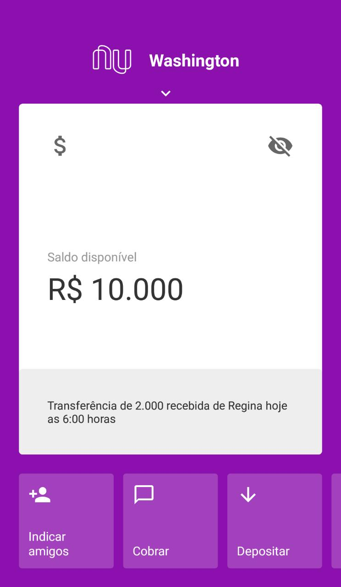
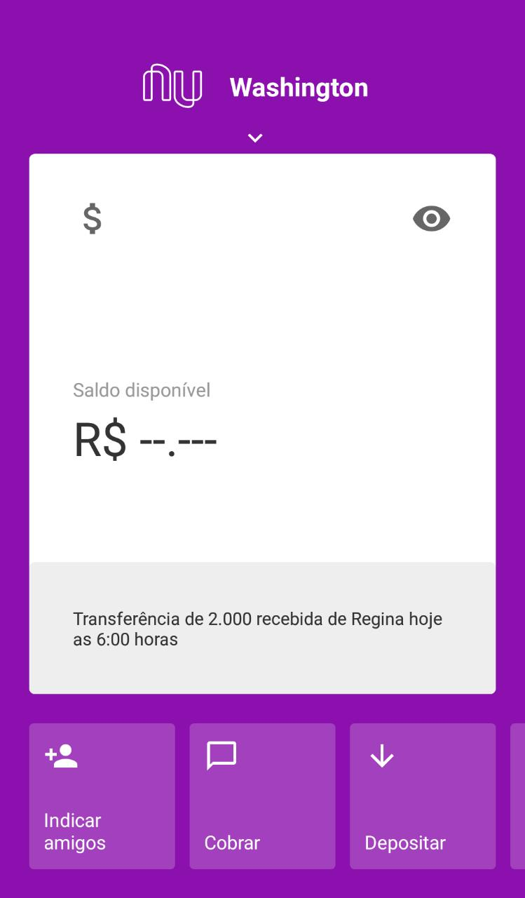

 

<h1 align='center'>
      
</h1>

 

<h1 align="center">
    
     
</h1>

<h2 title='#projeto'>
    Projeto
</h2>

Estudo React-native, clonando aplicação nubank através da [video aula](https://www.youtube.com/watch?v=DDm0M_rZLJo&t=303s).

<h2 title='#tecnologias'>
    Tecnologias
</h2>

Esse projeto foi desenvolvido com as seguintes tecnologias:

- React-native

<h2 title='#bibliotecas'>
    Bibliotecas
</h2>

Foram utilizadas as seguintes bibliotecas:

- styled-components
- react-native-gesture-handler
- @expo/vector-icons
- react-native-qrcode-generator

## Script de execução do projeto

No diretório do projeto, você pode executar:

### `yarn install`

Instala as dependências necessárias para a execução do projeto.  

### `yarn start`

